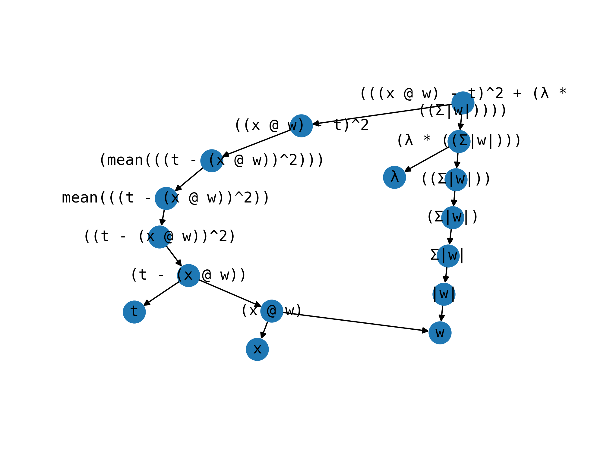

# nanograd

[](https://github.com/zackxzhang/nanograd)
[](https://www.python.org)
[](https://opensource.org/licenses/BSD-3-Clause)
[](https://github.com/zackxzhang/nanograd)

<br>

### Concept
**nanograd** is a conceptual prototype of automatic differentiation that

- illustrates fundamental principles behind **differentiable programming**
    - traces gradients through the directed acyclic graph of tensors and operators
- simply works in 1000 lines of code (smoke tested with **RNN on MNIST**)
    - achieves 90%+ accuracy with simple initialization, vanilla SGD, and no normalization

#### design
- **nanograd** resembles Torch (dynamic, global, object-oriented)
- ... more than it resembles Jax (static, local, functional)

#### structure
- leaves: parameters (tensors with gradient) and variables (tensors w.o. gradient)
- branches: operators that compose together parameters, variables and other operators

<br>

### Examples
- lasso regression [here](./ols.py)
```python
# model
t = Variable (t, tag='t')
x = Variable (x, tag='x')
w = Parameter(w, tag='w')
y = x @ w

# optimizer
optim = Optimizer(alpha=0.1)

# training
for _ in range(50):
    loss = squared_error(y, t) + 0.1 * lasso(w)
    trace(loss, Zero())
    params: list[Parameter] = list()
    trace(loss, Back(params))
    optim.step(params)
```
- logistic regression [here](./glm.py)
```python
# model
t = Variable (t, tag='t')
x = Variable (x, tag='x')
w = Parameter(w, tag='w')
y = sigmoid(x @ w)

# optimizer
optim = Optimizer(alpha=0.5)

# training
for _ in range(800):
    loss = cross_entropy(y, t)
    trace(loss, Zero())
    params: list[Parameter] = list()
    trace(loss, Back(params))
    optim.step(params)
```
- gated recurrent network [here](./gru.py)
```python
...

def gru(x, e, h, Wz, Uz, bz, Wr, Ur, br, Wh, Uh, bh):
    z = sigmoid(x @ Wz + h @ Uz + e @ bz)
    r = sigmoid(x @ Wr + h @ Ur + e @ br)
    c = tanh(x @ Wh + (r * h) @ Uh + e @ bh)
    return (1. - z) * h + z * c

def clf(x, e, W, b):
    logits = x @ W + e @ b
    probs = softmax(logits)
    return probs

...
```
- computational graph [here](./vis.py)
```
+-- (((x @ w) - t)^2 + (λ * ((Σ|w|))))
    |-> (λ * ((Σ|w|)))
    |   |-> ((Σ|w|))
    |   |   !
    |   |   (Σ|w|)
    |   |   !
    |   |   Σ|w|
    |   |   !
    |   |   |w|
    |   |   !
    |   |   w <- (x @ w)
    |   L-> λ
    L-> ((x @ w) - t)^2
        !
        (mean(((t - (x @ w))^2)))
        !
        mean(((t - (x @ w))^2))
        !
        ((t - (x @ w))^2)
        !
        (t - (x @ w))
        |-> (x @ w)
        |   |-> x
        |   L->  ...
        L-> t
```
